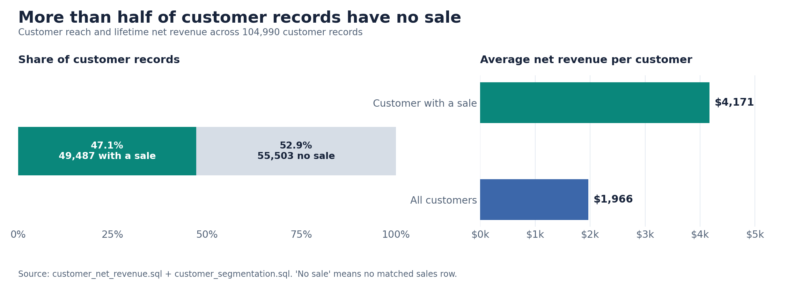
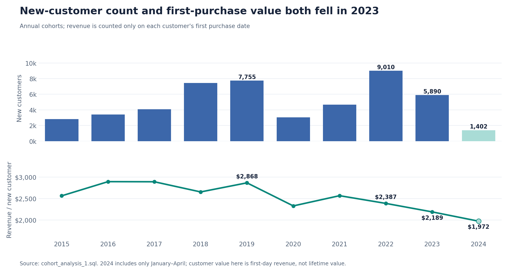
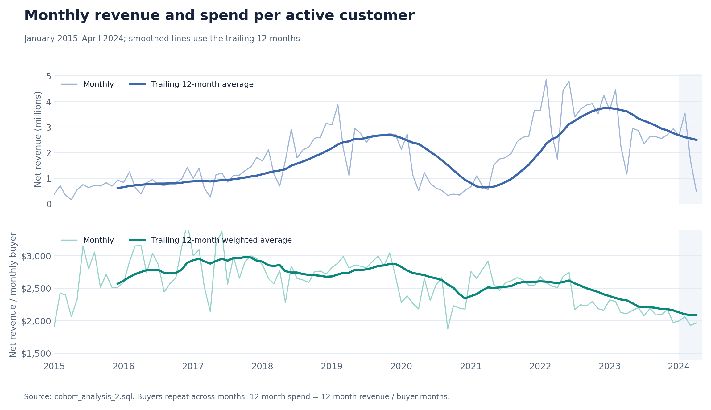
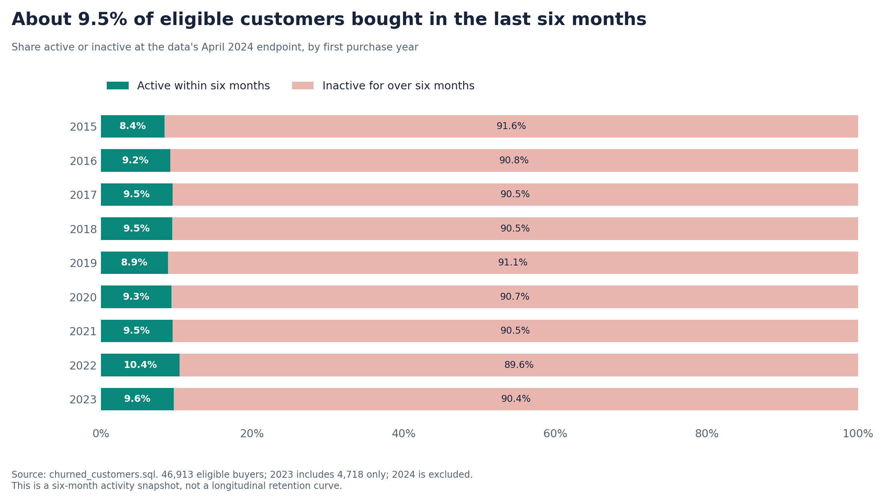

# Contoso Customer Behavior and Retention Analysis

## Overview

Analyzed Contoso customer and sales data with PostgreSQL to understand purchasing behavior, customer value, acquisition trends, monthly revenue, and customer inactivity. The sales data runs from January 2015 through April 2024.

A reusable SQL view connects customer information to purchase activity. Five analyses then answer specific business questions using that view and the underlying sales and customer tables.

## Business Questions

1. **Customer Reach:** How many customer records have a recorded purchase?
2. **Customer Segmentation:** Which customers contribute the most net revenue?
3. **Acquisition Cohorts:** How have new-customer counts and first-purchase values changed?
4. **Monthly Performance:** Are changes in revenue associated with the number of purchasing customers, spending per customer, or both?
5. **Customer Inactivity:** What share of eligible customers has not purchased in the last six months?

## Analysis Approach

### Data Foundation: Customer Cohort View

- Calculated net revenue from quantity, net price, and exchange rate.
- Combined sales with customer information and aggregated revenue by customer and order date.
- Used a window function to identify each customer's first purchase date and acquisition year.
- Reused the resulting view across the segmentation, cohort, monthly, and inactivity analyses.

🖥️ Query: [View.sql](View.sql)

### 1. Customer Reach and Average Revenue

- Calculated average historical net revenue for customers with sales.
- Compared that figure with the average across all customer records, including those without a matched sale.
- Reconciled the results with the segmentation totals to identify the number of customers with and without recorded purchases.

🖥️ Query: [customer_net_revenue.sql](customer_net_revenue.sql)

**📈 Visualization:**

Customer purchase reach and average net revenue

**📊 Key Findings:**

- **49,487 of 104,990 customer records (47.1%)** have a recorded sale. The remaining **55,503 (52.9%)** have no matched sale.
- Average historical net revenue is **$4,171 per customer with a sale**, compared with **$1,966 across all customer records**.

**💡 Business Insights:**

- Check whether the 55,503 records without sales are valid prospects, inactive accounts, or incomplete customer records before using them in an acquisition campaign.
- Track the share of customer records that make a first purchase. It provides a clearer measure of customer activation than the size of the customer table alone.

### 2. Customer Segmentation

- Summed each purchasing customer's recorded net revenue.
- Used the 25th and 75th percentiles to assign customers to Low, Mid, and High-value segments.
- Compared each segment's share of customers with its share of net revenue.

🖥️ Query: [customer_segmentation.sql](customer_segmentation.sql)

**📈 Visualization:**

Customer share compared with net revenue share by value segment
.png>)
**📊 Key Findings:**

- **High value:** 12,372 customers (**25.0%** of purchasing customers) generated **$135.4M**, or **65.6%** of recorded net revenue. Average historical revenue per customer was **$10,946**.
- **Mid value:** 24,743 customers (**50.0%**) generated **$66.6M**, or **32.3%** of revenue. Average historical revenue per customer was **$2,693**.
- **Low value:** 12,372 customers (**25.0%**) generated **$4.34M**, or **2.1%** of revenue. Average historical revenue per customer was **$351**.

**💡 Business Insights:**

- Prioritize service and retention experiments for high-value customers because a relatively small group accounts for most recorded revenue.
- Test relevant cross-sell or repeat-purchase offers with the mid-value group. Measure the additional revenue against the cost of each offer.
- Use low-cost campaigns for the low-value group and evaluate whether they increase purchase frequency profitably.

### 3. Acquisition Cohorts and First-Purchase Value

- Grouped customers by the year of their first purchase.
- Counted new customers and calculated revenue recorded **on their first purchase date**.
- Compared first-purchase-day revenue per new customer across annual cohorts.

🖥️ Query: [cohort_analysis_1.sql](cohort_analysis_1.sql)

**📈 Visualization:**

New customers and first-purchase-day revenue by cohort year

**📊 Key Findings:**

- New customers fell from **9,010 in 2022** to **5,890 in 2023**, a **34.6% decrease**.
- Revenue on the first purchase date per new customer fell from **$2,387 in 2022** to **$2,189 in 2023**, an **8.3% decrease**.
- The **2024 cohort contains only January–April data** and should not be compared directly with complete years.

**💡 Business Insights:**

- Investigate the 2023 drop in new customers by acquisition channel, region, or product category when those attributes are available.
- Examine first purchases to determine whether changes in basket size, products purchased, or discounts contributed to lower initial value.
- Treat this measure as **first-purchase-day revenue**, rather than a cohort's lifetime value or retention rate.

### 4. Monthly Revenue and Purchasing-Customer Value

- Calculated monthly net revenue and distinct customers who purchased in each month.
- Divided monthly revenue by monthly purchasing customers.
- Used trailing 12-month averages in the visualization to make the underlying trend easier to see.

🖥️ Query: [cohort_analysis_2.sql](cohort_analysis_2.sql)

**📈 Visualization:**

Monthly net revenue and revenue per purchasing customer

**📊 Key Findings:**

- Annual net revenue fell from **$44.9M in 2022** to **$33.1M in 2023**, a **26.2% decrease**.
- The average number of purchasing customers per month fell from **1,554** to **1,277**, a **17.8% decrease**.
- Revenue per monthly purchasing customer, weighted across each full year, fell from **$2,406** to **$2,161**, a **10.2% decrease**.

**💡 Business Insights:**

- Both fewer monthly purchasing customers and lower revenue per purchasing customer contributed to the 2023 revenue decline. The results do not establish what caused either change.
- Monitor these two measures separately to distinguish customer-activity problems from changes in spending.
- Break down the decline by product, geography, and customer segment before choosing a promotion or retention strategy.

### 5. Six-Month Customer Inactivity

- Identified each customer's most recent purchase.
- Labeled customers **Active** if their most recent purchase was within six months of the dataset's latest order date; otherwise, labeled them **Churned** in the SQL output.
- Included only customers whose first purchase occurred before the six-month cutoff.

🖥️ Query: [churned_customers.sql](churned_customers.sql)

**📈 Visualization:**

Six-month customer activity status by acquisition cohort

**📊 Key Findings:**

- Of **46,913 eligible customers**, **42,472 (90.5%)** had not purchased within the last six months. **4,441 (9.5%)** had purchased.
- The active share ranges from **8.4% to 10.4%** across the eligible 2015–2023 cohorts.
- Only **4,718 of the 5,890 customers acquired in 2023** meet the eligibility cutoff. The 2024 cohort is excluded.

**💡 Business Insights:**

- Test win-back campaigns for customers who have passed the six-month mark, and measure repeat purchases and incremental revenue against campaign cost.
- Join customer-level value segments to last-purchase dates to identify high-value customers who are currently inactive.
- Interpret this result as a **six-month activity snapshot**. It does not show how retention changed at each stage of a cohort's life.

## Strategic Recommendations

1. **Protect high-value customers**
   - Combine value segments with last-purchase dates to find high-value customers who have become inactive.
   - Test targeted service or win-back offers and measure their incremental value.

2. **Investigate the 2023 acquisition decline**
   - Examine why new-customer count fell by 34.6% and first-purchase-day revenue per customer fell by 8.3%.
   - Compare acquisition channels, first-order products, and discounts before allocating more campaign spend.

3. **Track the two drivers of monthly revenue**
   - Report monthly purchasing customers and revenue per purchasing customer alongside total revenue.
   - Use product and regional breakdowns to locate the sources of the 2023 decline.

4. **Validate and activate customers without recorded sales**
   - Review the 55,503 unmatched customer records before treating them as prospects.
   - For eligible prospects, test first-purchase campaigns and measure conversion and incremental revenue.